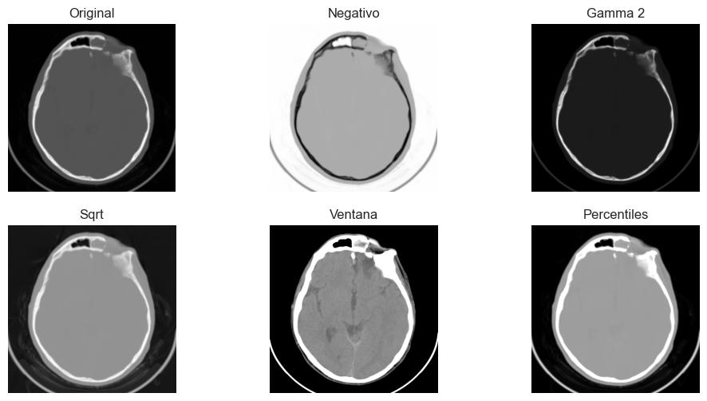

# 🧠 Algoritmos Básicos de Tratamiento Digital de Imágenes Biomédicas

Este proyecto aborda distintas técnicas fundamentales de procesamiento de imágenes médicas usando Python, aplicadas a una imagen DICOM de una tomografía computarizada (TC) de cráneo.

## 🧾 Descripción del Proyecto

Este repositorio contiene la implementación en Python de una práctica de procesamiento digital de imágenes biomédicas. Se estudia una imagen médica real (DICOM) mediante distintas técnicas como visualización por ventanas, generación de histogramas y ajustes de contraste.

## ⚙️ Tecnologías y Librerías

- `numpy`: procesamiento de matrices.
- `matplotlib`: visualización de imágenes e histogramas.
- `pydicom`: lectura y tratamiento de imágenes DICOM.

## 📸 Procesamiento Realizado

### 1. Acceso y visualización de metadatos

Se obtiene información relevante como:

- Modalidad: **CT**
- Resolución: **512x512**
- Bits por píxel: **12**
- Descripción anatómica: **Tejido cerebral (plano transversal superior a las cavidades oculares)**

### 2. Análisis del histograma

Se generan histogramas por dos métodos:

- Usando `np.histogram()`
- Usando `np.unique()` y frecuencias relativas

🔍 Ambos métodos permiten identificar picos relevantes:
- Valores oscuros (fondo de la imagen)
- Zona intermedia (~1050) correspondiente al tejido encefálico

### 3. Visualización por ventanas

Se aplican ventanas de visualización específicas para mejorar el contraste:

- 🧠 **Tejido cerebral**: ventana `[950, 1150]` (12 bpp)
- 🦴 **Tejido óseo**: ventana `[1100, 4000]` (12 bpp)

Estas ventanas permiten visualizar estructuras invisibles en la imagen original.

### 4. Modificación de contraste

Se aplican transformaciones para resaltar regiones de interés:

- Negativo de imagen
- Corrección gamma (γ = 2)
- Ajuste raíz cuadrada (`sqrt`)
- Ajuste lineal entre los percentiles 5% y 95%
- Ajuste lineal manual (mejor resultado para tejido cerebral)

### 5. Exportación

Las imágenes procesadas se guardan en:

- **PNG** con 12 bits por píxel
- **JPG** tras convertir a 8 bits por píxel (`uint8`)

## ✅ Conclusión

El método más efectivo para visualizar el tejido cerebral ha sido el **ajuste lineal manual mediante ventana**, mientras que la **corrección gamma** ha sido útil para visualizar estructuras óseas. A continuación se muestra una imagen comparativa de los distintos métodos aplicados:

